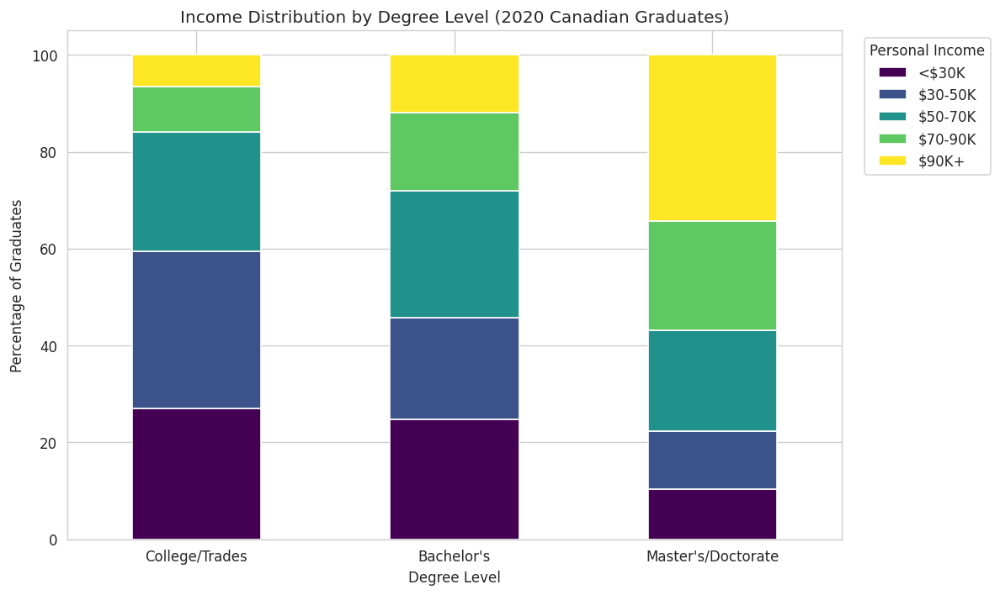
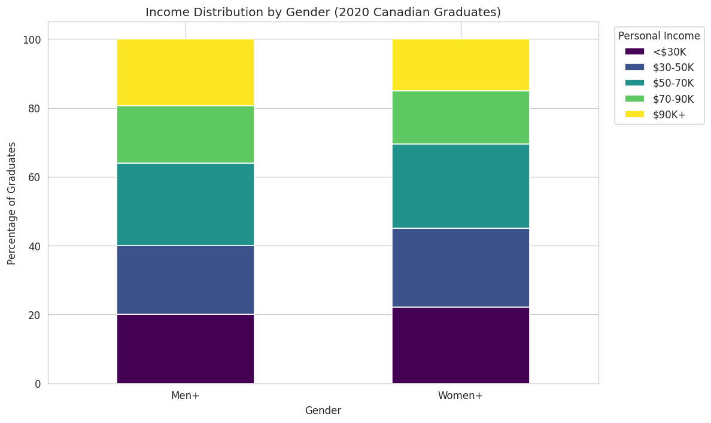
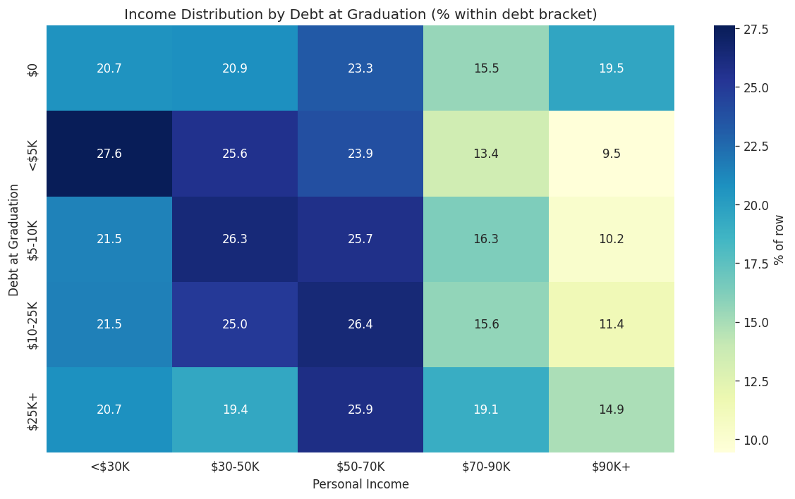

# Predicting Post-Graduation Earnings (NGS 2020)

An analysis of post-graduation earnings for Canadian graduates using the 2020 National Graduates Survey (NGS), examining how degree level, gender, field of study, region, age, and student debt relate to earnings outcomes.

## Background

This is a v2 rebuild of a research project originally completed in ECO225 (Big-Data Tools for Economists, University of Toronto, Fall 2025). I went back to the project after the course to apply more rigorous methodology — switching to ordered logistic regression (the appropriate model for an ordinal outcome), expanding the control variables, and adding cross-validation for the classification model.

## Data

[Statistics Canada — National Graduates Survey, 2020 (Public Use Microdata File)](https://www150.statcan.gc.ca/n1/en/catalogue/81M0011X)

The dataset contains 16,138 graduate records with 116 variables covering education history, student loans, employment outcomes, and demographics. After dropping observations with missing values on the variables used in the regression, the analysis sample is 11,058 graduates.

The raw data file is not included in this repo (it is a free download from the link above).

## Methodology

**Outcome variable:** Personal income, coded as 5 ordered brackets ranging from `<$30K` to `$90K+`.

**Why ordered logistic regression:** The original project converted income brackets to dollar midpoints and ran OLS, which assumes equal dollar gaps between brackets. Since the top bracket is open-ended (`$90K+`) and the gaps aren't truly equal, ordered logit is the methodologically correct choice — it respects the ordering of brackets without making assumptions about the dollar distance between them.

**Controls:** Degree level, gender, region, age at graduation, field of study (10 categories), full-time vs. part-time work status, and visible minority status. Categorical variables are dummy-encoded with the most common category as the reference group.

**Sensitivity check:** OLS is also reported (treating brackets as a 1-5 numeric scale) so that an interpretable R-squared can be reported and compared against typical undergraduate econometrics output.

**Classification task:** Defined a "high earner" as someone in the top two income brackets (≥$70K). Compared a KNN classifier (with 5-fold cross-validation across k ∈ {3, 5, 7, 9, 13, 19, 25, 35}) against a logistic regression baseline.

## Selected Findings

**Ordered logit regression (n = 11,058):**

| Predictor | Coefficient | Interpretation |
|---|---|---|
| Master's/Doctorate (vs. College) | +1.89 *** | Large positive shift up the income distribution |
| Bachelor's (vs. College) | +0.97 *** | Substantial positive shift |
| Part-time work (vs. full-time) | -2.16 *** | The largest single predictor; part-time work pulls income sharply down |
| Women+ (vs. Men+) | -0.33 *** | Statistically significant residual gender gap after controlling for everything else |
| Debt at graduation (per bracket) | -0.04 ** | Higher debt is weakly associated with lower income, conditional on controls |
| Older age at graduation | +0.41 to +1.27 *** | Likely picking up labour market experience |
| Visible minority (No vs. Yes) | +0.40 *** | Non-visible-minority graduates earn more, controlling for other factors |

(Significance: `***` p < 0.001, `**` p < 0.01)

**OLS sensitivity check:**
- R-squared = **0.322** — the regression explains about 32% of the variance in income brackets, which is in line with what the labour economics literature finds for individual earnings predictions from observable characteristics.

**Classification:**
| Model | Test accuracy |
|---|---|
| Logistic regression | 0.730 |
| KNN (best k = 35, by 5-fold CV) | 0.726 |

Logistic regression slightly outperformed KNN, which is consistent with KNN's known weakness in higher-dimensional settings (the dummy-encoded predictor matrix has 20 columns).

## Visualizations

## Tools

Python (Pandas, NumPy, Statsmodels, Scikit-Learn, Matplotlib, Seaborn)

## Files

- `ngs_earnings_analysis.py` — main analysis script with inline comments
- `outputs/` — generated visualizations

## Key Caveats

- The income variable is bracketed, so all results should be interpreted as effects on income *bracket*, not on dollar earnings directly.
- The NGS is a cross-section. The associations identified above are not causal effects — graduates with higher debt may differ from low-debt graduates in unobserved ways (family background, field selection, etc.).
- The gender gap coefficient should not be read as evidence of pure discrimination. It is the residual difference *after* controlling for available observables, which still leaves room for differences in occupation, employer, hours worked beyond FT/PT, and other factors not captured in the survey.
